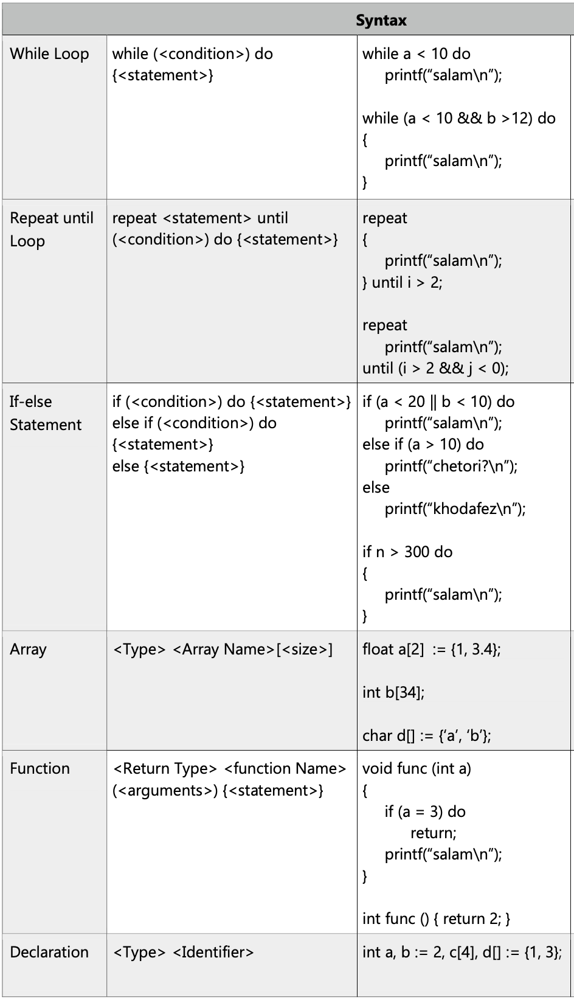
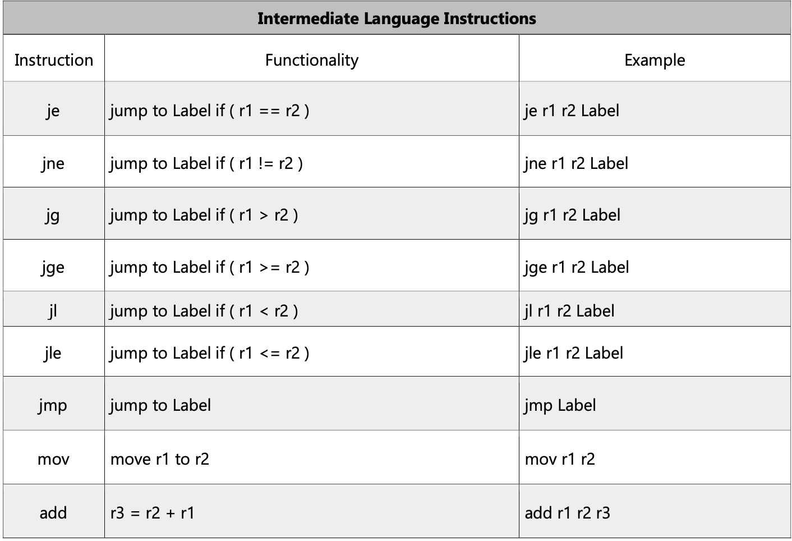

# **Kolang** compiler:
Compiler course final project implemented with the java programming language. 
Made for compiling kolang programming language, a language with syntaxes similar to c/c++. 
This project was done in three phases: 
1. Scanner
2. Parser
3. Code generator (generates pseudo-assembly code)

The grammar of this language can be accessed in the grammar directory. 
The compiler is made from scratch and no predefined libraries are used. 
The compiler can also be run from the command-line interpreter(cmd) using colang.bat batch file if given the code path. 

What this compiler supports: 
## Token Definition
  
## Key Words
 
## Operators
 
## Syntax
 
 
 
 
## Intermediate Language Instructions
 
 
